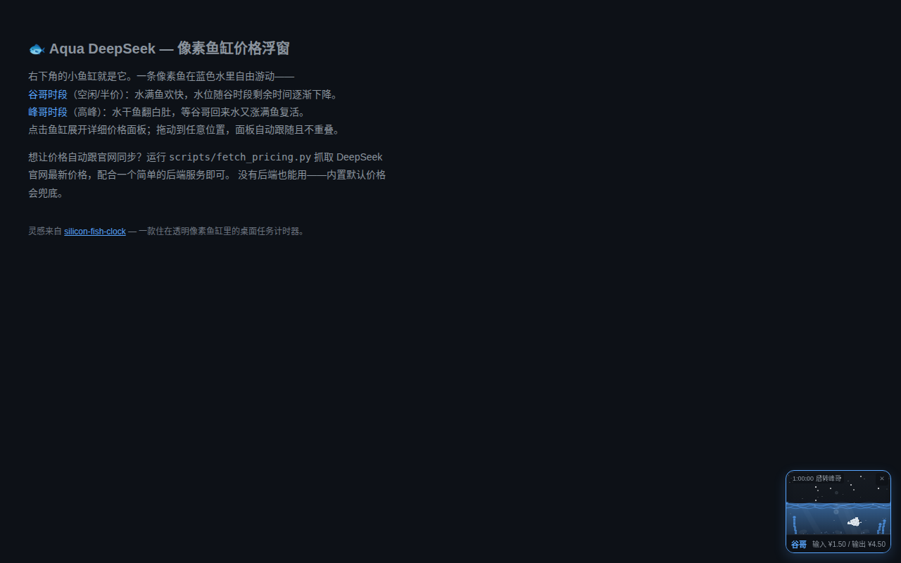

# 🐟 Aqua DeepSeek — DeepSeek API 实时价格鱼缸浮窗

一条住在像素鱼缸里的自由游动的鱼，实时显示 [DeepSeek API](https://api-docs.deepseek.com/zh-cn/quick_start/pricing/) 的峰谷价格。**一键装进 DeepSeek Harness**，也可以独立嵌入任何网页。

> 灵感来自 [silicon-fish-clock](https://github.com/Gayaya999/silicon-fish-clock)

<p align="center">
  <a href="README.en.md">🌐 English</a> · <b>中文</b>
</p>

## 🚀 快速开始（独立网页）

**一行引入，放 `<body>` 底部，零后端依赖，开箱即用：**

```html
<script src="deepseek-price-widget.js"></script>
```

右下角出现鱼缸浮窗，使用内置默认价格，不需要后端。

## DeepSeek Harness 插件

**一行命令装进 DeepSeek Harness，鱼缸自动出现在界面右下角：**

```bash
dsh plugin --profile web add aqua-deepseek
dsh plugin --profile headless add aqua-deepseek
systemctl --user restart dsh-web
```

插件做了三件事：
1. **注入鱼缸浮窗** — 通过 `webserver/index-inject` 把浮窗脚本注入 DeepSeek Harness 页面
2. **注入主题 CSS** — 覆盖 CSS 变量让浮窗匹配 DeepSeek Harness 的白色主题
3. **注册 `aqua_price` 工具** — AI 可查询 DeepSeek 实时价格/获取嵌入码/切换主题

## 效果预览

| 梁文谷时段（空闲/半价） | 梁文峰时段（高峰） |
|:---:|:---:|
|  |  |
| 蓝水满缸，鱼欢快游动 | 水干鱼翻白肚，沉底等梁文谷回来 |

| 冬季主题 ❄️ | 秋季主题 🍂 |
|:---:|:---:|
|  |  |
| 冰蓝水 + 雪花飘落 | 琥珀水 + 落叶飘零 |

## 行为说明

| 状态 | 鱼缸 | 说明 |
|---|---|---|
| **梁文谷时段**（空闲/半价） | 🔵 蓝水满缸 + 鱼欢快游 | 水位随谷时段剩余时间逐渐下降；水快干时鱼游得慢 |
| **梁文峰时段**（高峰） | 🏜️ 水干→沙漠主题 | 灰色死鱼沉在缸底、偶尔扑腾闪白；梁文谷回来水涨满鱼复活 |

- **桌面端**（>768px）= 鱼缸陪伴模式；**移动端**（≤768px）= 胶囊模式自动回退
- 浮窗可拖动，**永远不超出窗口**，面板**不与浮窗重叠**
- **跟随主站真实主题色**（CSS 变量映射），自动适配明暗主题
- 鱼会好奇靠近鼠标，受惊时冲刺逃走；点水体投喂、点鱼身受惊
- 死亡时嘴里冒出最后的气泡，复活时气泡爆发 + 庆祝冲刺
- 水中有尘埃微粒漂浮、顶部光束斜射、水面贴壁微微上弯（张力）
- **过食彩蛋**：4 秒内吃掉 ≥50 粒鱼食 → 翻白浮水面（翻白期间鱼不动、点击不投喂不惊动）
- 鱼食落缸底即消失
- **20+ 彩蛋**：大鱼吃鱼/同伴鱼/冒爱心/水母/螃蟹/海龟/变金/转圈/泡泡雨…（低谷）；风滚草/仙人掌/秃鹫/闪电/蜥蜴/响尾蛇/枯树/沙丘…（高峰干旱）
- 高峰水退→**沙漠主题**平滑切换（暖黄天空/烈日/沙丘/仙掌/枯树剪影），死鱼扑腾闪白

## 主题系统

内置 5 个主题，可通过 JS 或后端切换：

```javascript
// 页面级设置（在加载 widget 之前）
window.__AQUA_THEME__ = 'winter';
```

| 主题 | 效果 | 鱼色 | 水色 | 装饰 |
|---|---|---|---|---|
| `default` | 默认 | 白色（跟随 --text） | 蓝色（跟随 --accent） | 无 |
| `winter` | 冬季 | 冰白 | 冰蓝 | ❄️ 雪花飘落 |
| `autumn` | 秋季 | 暖黄 | 琥珀 | 🍂 落叶飘零 |
| `spring` | 春季 | 粉白 | 浅蓝 | 🌸 樱花瓣 |
| `harness` | DeepSeek Harness 插件 | 深色 | 蓝色 | 无 |

## 配置（全接口化）

浮窗**运行时零硬编码**——价格、时段、颜色、物理、文案全部可通过 `window.AQUA_DEEPSEEK_CONFIG` 覆盖（与内置默认深合并）：

```html
<script>
window.AQUA_DEEPSEEK_CONFIG = {
  models: { flash: { output: { off: 4.50, peak: 9.00 } } },  // 改价格
  physics: { overflowFeedCount: 80 },                          // 4秒吃80粒才翻白
  defaultModel: 'pro'
};
</script>
<script src="deepseek-price-widget.js"></script>
```

> **完整字段级配置指南**见 [CONFIG_GUIDE.md](CONFIG_GUIDE.md)（含每个字段注释 + 可直接复制的 `aqua-config-template.json` 模板）。

### 主题自动跟随网站配色

浮窗内部变量已映射到主站真实 CSS 变量：`--accent→--accent-primary`、`--warn→--accent-cta`、`--card2→--bg-secondary` 等，明暗主题自动跟随宿主站点。

## 自动更新价格（可选）

内置价格会过时，用抓取脚本自动同步官网：

```bash
python3 scripts/fetch_pricing.py --out ds_price_config.json
```

然后用任意后端在 `/api/ds-price-config` 返回这个 JSON。没有后端也能用——内置默认价格永远兜底。

**部署示例：**

```bash
cd examples
python3 server.py --port 8080
# 浏览器打开 http://localhost:8080
```

## 项目结构

```
aqua-deepseek/
├── deepseek-price-widget.js       # 前端浮窗（自包含，Shadow DOM 隔离）
├── index.ts                       # DeepSeek Harness 插件入口（Cordis）
├── cordis.patch.yml               # DeepSeek Harness bundle 插件注册
├── package.json                   # npm 包（含 dsh bundle 元数据）
├── scripts/
│   └── fetch_pricing.py           # DeepSeek 官网价格自动抓取
├── examples/
│   ├── index.html                 # 演示页面
│   ├── server.py                  # 简易后端
│   └── ds_price_config.example.json
├── docs/                          # 预览截图
├── CONFIG_GUIDE.md                # 完整配置指南（字段注释 + 示例）
├── aqua-config-template.json      # 可直接复制的配置模板
├── LICENSE                        # MIT
└── README.md / README.en.md
```

## 许可

[MIT License](LICENSE) · © 2026 LiJiaChuan · 受 [silicon-fish-clock](https://github.com/Gayaya999/silicon-fish-clock) 启发
