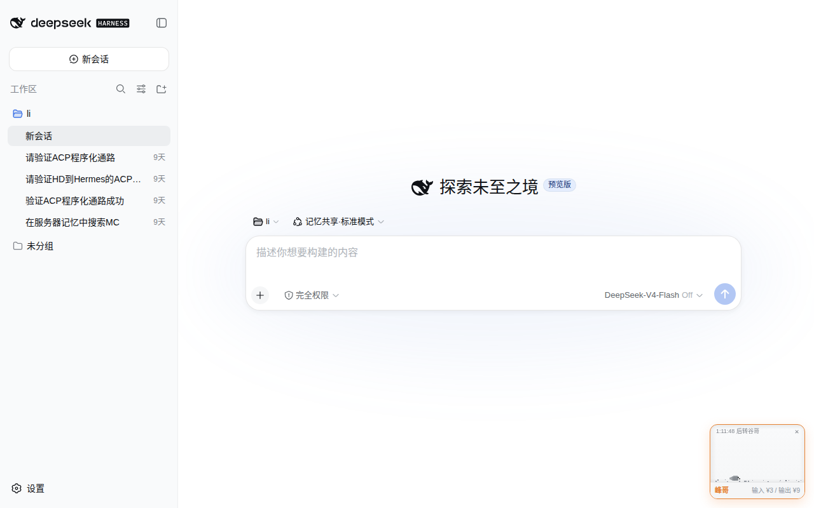

# 🐟 Aqua DeepSeek — DeepSeek API 实时价格鱼缸浮窗

一条住在像素鱼缸里的自由游动的鱼，实时显示 [DeepSeek API](https://api-docs.deepseek.com/zh-cn/quick_start/pricing/) 的峰谷价格。**一键装进 DeepSeek Harness**，也可以独立嵌入任何网页。

> 灵感来自 [silicon-fish-clock](https://github.com/Gayaya999/silicon-fish-clock)
> — 一款住在透明像素鱼缸里的桌面任务计时器。

<details>
<summary>🌐 English</summary>

A pixel-fish aquarium that lives in your webpage's corner, showing real-time
[DeepSeek API](https://api-docs.deepseek.com/zh-cn/quick_start/pricing/) pricing
with peak/off-peak visual feedback. Install into [DeepSeek Harness](https://deepseek.com)
with one command, or embed standalone in any webpage.

> **Inspired by** [silicon-fish-clock](https://github.com/Gayaya999/silicon-fish-clock).

### Quick start (standalone)

```html
<script src="deepseek-price-widget.js"></script>
```

### Install into DeepSeek Harness

```bash
dsh plugin --profile web add aqua-deepseek
dsh plugin --profile headless add aqua-deepseek
systemctl --user restart dsh-web
```

The fish tank appears in DeepSeek Harness's bottom-right corner with a matching light theme.

### Features

- Fish swims freely; water level = remaining off-peak time
- Peak: water drains, fish dies (belly-up); off-peak: water rises, fish revives
- Desktop = aquarium; mobile (≤768px) = pill capsule
- Draggable, viewport-clamped, panel never overlaps widget
- Auto-detects page theme (dark/light) via CSS custom properties
- DeepSeek Harness plugin: white background, dark fish, blue water — matches DeepSeek Harness UI

### Optional: auto-update pricing

```bash
python3 scripts/fetch_pricing.py --out ds_price_config.json
# Serve JSON at /api/ds-price-config with any backend
```

</details>

---

## 🚀 DeepSeek Harness 插件

**一行命令装进 DeepSeek Harness，鱼缸自动出现在 DeepSeek Harness 界面右下角：**

```bash
dsh plugin --profile web add aqua-deepseek
dsh plugin --profile headless add aqua-deepseek
systemctl --user restart dsh-web
```

| DeepSeek Harness 内效果 | 配套说明 |
|:---:|:---|
|  | 白底深色鱼蓝水，自动匹配 DeepSeek Harness 浅色主题 |

插件做了三件事：
1. **注入鱼缸浮窗** — 通过 `webserver/index-inject` 把浮窗脚本注入 DeepSeek Harness 页面
2. **注入主题 CSS** — 覆盖 CSS 变量让浮窗匹配 DeepSeek Harness 的白色主题
3. **注册 `aqua_price` 工具** — AI 可查询 DeepSeek 实时价格/获取嵌入码/切换主题

---

## 效果预览

| 谷哥时段（空闲/半价） | 峰哥时段（高峰） |
|:---:|:---:|
|  |  |
| 蓝水满缸，白鱼欢快游动 | 水干鱼翻白肚，沉底等谷哥回来 |

| 冬季主题 ❄️ | 秋季主题 🍂 |
|:---:|:---:|
|  |  |
| 冰蓝水 + 雪花飘落 | 琥珀水 + 落叶飘零 |

| 面板展开 | 移动端 |
|:---:|:---:|
|  |  |
| 点击鱼缸展开价格面板 | 移动端自动回退为胶囊模式 |

---

## 快速开始（独立网页）

**一行引入，放 `<body>` 底部，零后端依赖，开箱即用：**

```html
<script src="deepseek-price-widget.js"></script>
```

右下角出现鱼缸浮窗，使用内置默认价格，不需要后端。

## 行为说明

| 状态 | 鱼缸 | 说明 |
|---|---|---|
| **谷哥时段**（空闲/半价） | 🔵 蓝水满缸 + 白鱼欢快游 | 水位随谷时段剩余时间逐渐下降；水快干时鱼游得慢 |
| **峰哥时段**（高峰） | ⚫ 水干鱼翻白肚 | 灰色死鱼沉在缸底；谷哥回来水涨满鱼复活 |

- **桌面端**（>768px）= 鱼缸陪伴模式；**移动端**（≤768px）= 胶囊模式自动回退
- 浮窗可拖动，**永远不超出窗口**，面板**不与浮窗重叠**
- 跟随主站主题色（CSS 变量），自动适配明暗主题
- 关闭后本次会话不再显示，重开浏览器恢复
- 鱼会好奇靠近鼠标，受惊时冲刺逃走
- 死亡时嘴里冒出最后的气泡，复活时气泡爆发 + 庆祝冲刺
- 水中有尘埃微粒漂浮、顶部光束斜射、水面贴壁微微上弯（张力）

## 主题系统

内置 4 个主题，可通过 JS 或后端切换：

```javascript
// 页面级设置（在加载 widget 之前）
window.__AQUA_THEME__ = 'winter';
```

| 主题 | 效果 | 鱼色 | 水色 | 装饰 |
|---|---|---|---|---|
| `default` | 默认 | 白色（跟随 --text） | 蓝色（跟随 --accent） | 无 |
| `winter` | 冬季 | 冰白 | 冰蓝 | ❄️ 雪花飘落 |
| `autumn` | 秋季 | 暖黄 | 琥珀 | 🍂 落叶飘零 |
| `spring` | 春季 | 白色 | 浅蓝 | 🌸 樱花瓣 |
| `hd` | DeepSeek Harness 插件 | 深色 `#1a1d21` | 蓝色 `65,118,230` | 无 |

后端配置也可指定主题：`ds_price_config.json` 中加 `"theme": "winter"` 字段。

自定义主题：直接修改 `AQUA_THEMES` 对象或通过 `window.AQUA_THEMES` 注入，支持 `fishColor`/`deadColor`/`waterRGB`/`decorations` 四个字段。`decorations` 数组支持 `'snow'`/`'leaves'`/`'petals'`，可扩展新的粒子效果。

## 自动更新价格（可选）

内置价格会过时，用抓取脚本自动同步官网：

```bash
python3 scripts/fetch_pricing.py --out ds_price_config.json
```

然后用任意后端在 `/api/ds-price-config` 返回这个 JSON。没有后端也能用——内置默认价格永远兜底。

**部署示例：**

```bash
cd examples
python3 server.py --port 8080
# 浏览器打开 http://localhost:8080
```

## 项目结构

```
aqua-deepseek/
├── deepseek-price-widget.js       # 前端浮窗（自包含，Shadow DOM 隔离）
├── index.ts                       # DeepSeek Harness 插件入口（Cordis，注册工具+注入浮窗）
├── cordis.patch.yml               # DeepSeek Harness bundle 插件注册
├── package.json                   # npm 包（含 dsh bundle 元数据）
├── scripts/
│   └── fetch_pricing.py           # DeepSeek 官网价格自动抓取
├── examples/
│   ├── index.html                 # 演示页面
│   ├── server.py                  # 简易后端
│   └── ds_price_config.example.json
├── docs/                          # 预览截图
├── LICENSE                        # MIT
└── README.md
```

## 配置

浮窗内置了 Flash 和 Pro 两个模型的默认价格，通过后端接口 `/api/ds-price-config` 可覆盖：

| 字段 | 说明 |
|---|---|
| `models` | 模型价格（flash/pro，含 cacheHit/cacheMiss/output × peak/off） |
| `segments` | 高峰时段，如 `[[9,12],[14,18]]` |
| `weekendOff` | 周末是否全天半价 |
| `theme` | 主题名（default/winter/autumn/spring/harness） |

## 许可

[MIT License](LICENSE) · © 2026 LiJiaChuan · 受 [silicon-fish-clock](https://github.com/Gayaya999/silicon-fish-clock) 启发
