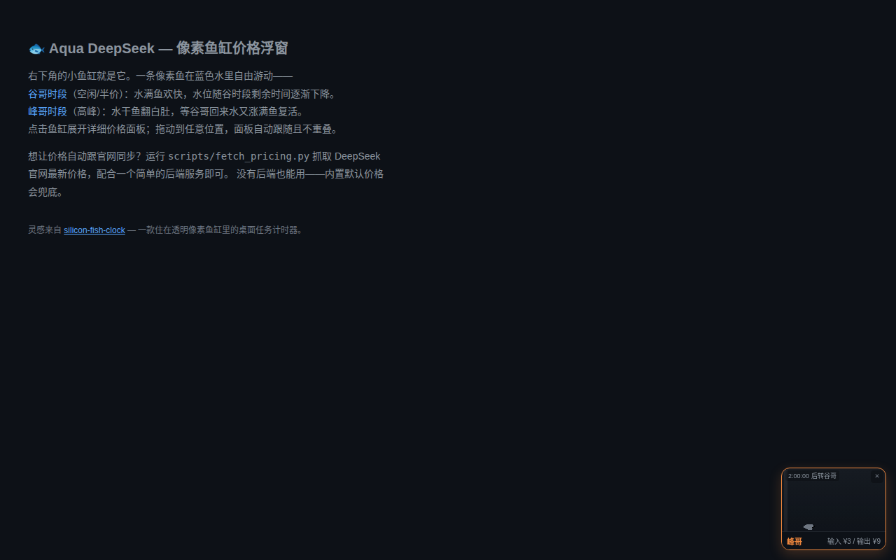
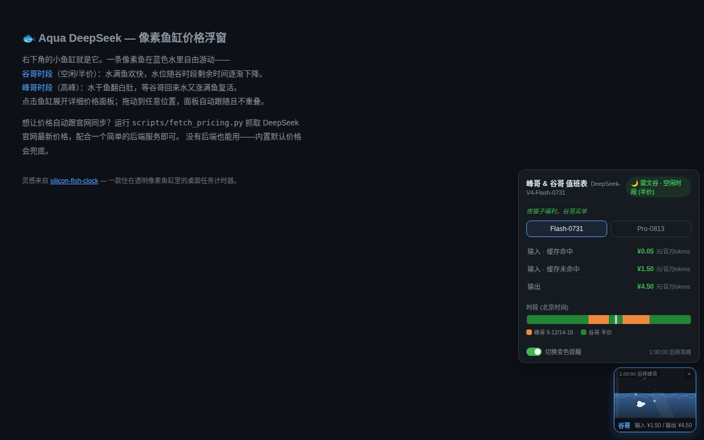
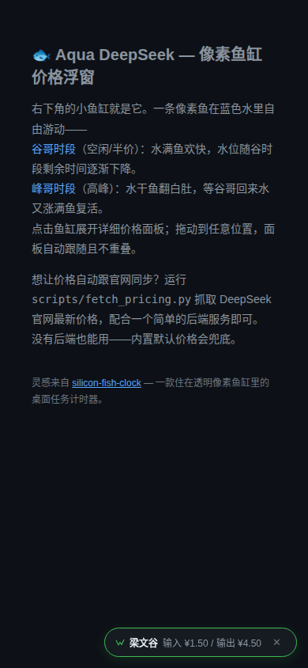

# 🐟 Aqua DeepSeek — 像素鱼缸 DeepSeek 价格浮窗

一条住在像素鱼缸里的自由游动的鱼，实时显示 [DeepSeek API](https://api-docs.deepseek.com/zh-cn/quick_start/pricing/) 的峰谷价格。

> 灵感来自 [silicon-fish-clock](https://github.com/Gayaya999/silicon-fish-clock)
> — 一款住在透明像素鱼缸里的桌面任务计时器。
> Aqua DeepSeek 把"像素鱼缸陪伴式"的理念搬到了网页端。

<details>
<summary>🌐 English</summary>

A pixel-fish aquarium that lives in your webpage's corner, showing real-time
[DeepSeek API](https://api-docs.deepseek.com/zh-cn/quick_start/pricing/) pricing
with peak/off-peak visual feedback.

> **Inspired by** [silicon-fish-clock](https://github.com/Gayaya999/silicon-fish-clock).

### Quick start

```html
<script src="deepseek-price-widget.js"></script>
```

Drop this single line at the bottom of any HTML `<body>`. A fish aquarium
appears with builtin pricing defaults — no backend required.

### Features

- Fish swims freely in blue water; water level = remaining off-peak time
- Peak hours: water drains, fish dies (belly-up); revives when off-peak returns
- Desktop (>768px) = aquarium mode; mobile (≤768px) = pill capsule fallback
- Draggable, clamped to viewport, panel never overlaps the widget
- Follows host page theme via CSS custom properties

### Optional: auto-update pricing

```bash
python3 scripts/fetch_pricing.py --out ds_price_config.json
# Serve the JSON at /api/ds-price-config with any backend
```

</details>

---

## 效果预览

| 谷哥时段（空闲/半价） | 峰哥时段（高峰） |
|:---:|:---:|
|  |  |
| 蓝水满缸，白鱼欢快游动 | 水干鱼翻白肚，沉底等谷哥回来 |

| 面板展开 | 移动端 |
|:---:|:---:|
|  |  |
| 点击鱼缸展开价格面板 | 移动端自动回退为胶囊模式 |

## 快速开始

**一行引入，放 `<body>` 底部，零后端依赖，开箱即用：**

```html
<script src="deepseek-price-widget.js"></script>
```

右下角就会出现鱼缸浮窗，使用内置默认价格，不需要任何后端服务。

## 行为说明

| 状态 | 鱼缸 | 说明 |
|---|---|---|
| **谷哥时段**（空闲/半价） | 🔵 蓝水满缸 + 白鱼欢快游 | 水位随谷时段剩余时间逐渐下降；水快干时鱼游得慢 |
| **峰哥时段**（高峰） | ⚫ 水干鱼翻白肚 | 灰色死鱼沉在缸底；谷哥回来水涨满鱼复活 |

- **桌面端**（>768px）= 鱼缸陪伴模式；**移动端**（≤768px）= 胶囊模式自动回退
- 浮窗可拖动，**永远不超出窗口**，面板**不与浮窗重叠**
- 跟随主站主题色（CSS 变量），支持明暗主题
- 关闭后本次会话不再显示，重开浏览器恢复

## 自动更新价格（可选）

内置价格会过时，用抓取脚本自动同步官网：

```bash
python3 scripts/fetch_pricing.py --out ds_price_config.json
```

然后用任意后端服务在 `/api/ds-price-config` 返回这个 JSON。没有后端也能用——内置默认价格永远兜底。

**部署示例：**

```bash
# 简易后端（标准库，无需 Flask）
cd examples
python3 server.py --port 8080
# 浏览器打开 http://localhost:8080
```

## 项目结构

```
aqua-deepseek/
├── deepseek-price-widget.js       # 前端浮窗（自包含，Shadow DOM 隔离）
├── scripts/
│   └── fetch_pricing.py           # DeepSeek 官网价格自动抓取
├── examples/
│   ├── index.html                 # 演示页面
│   ├── server.py                  # 简易后端（提供价格配置接口）
│   └── ds_price_config.example.json
├── docs/                          # 预览截图
├── LICENSE                        # MIT
└── README.md
```

## 配置

浮窗内置了 Flash 和 Pro 两个模型的默认价格，通过后端接口 `/api/ds-price-config` 可覆盖：

| 字段 | 说明 |
|---|---|
| `models` | 模型价格（flash/pro，含 cacheHit/cacheMiss/output × peak/off） |
| `segments` | 高峰时段，如 `[[9,12],[14,18]]` |
| `weekendOff` | 周末是否全天半价 |

## 许可

[MIT License](LICENSE) · © 2026 LiJiaChuan · 受 [silicon-fish-clock](https://github.com/Gayaya999/silicon-fish-clock) 启发
